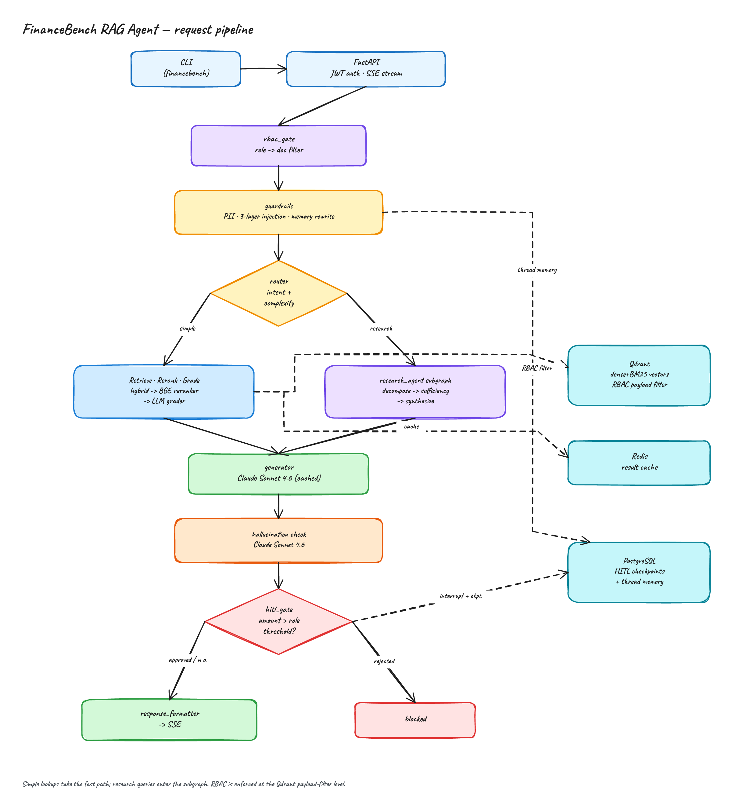
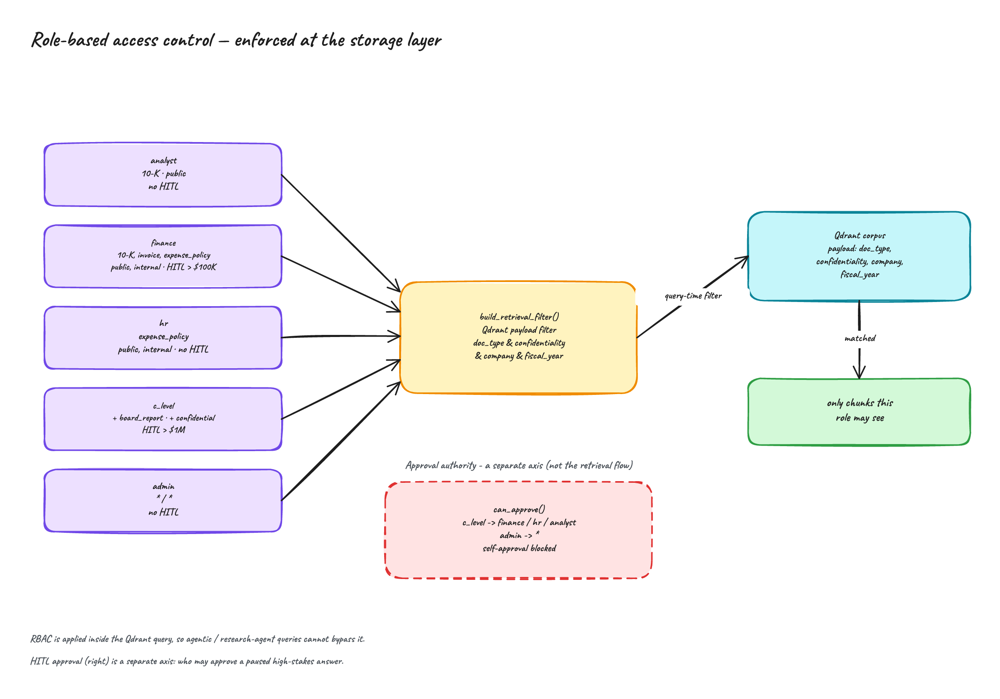
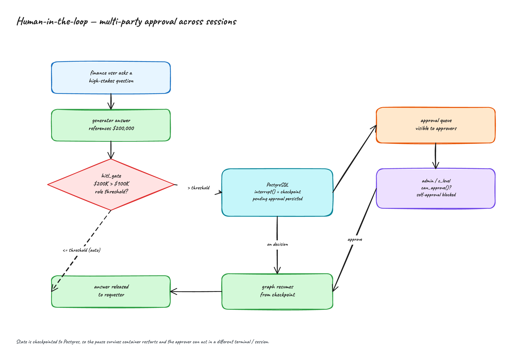
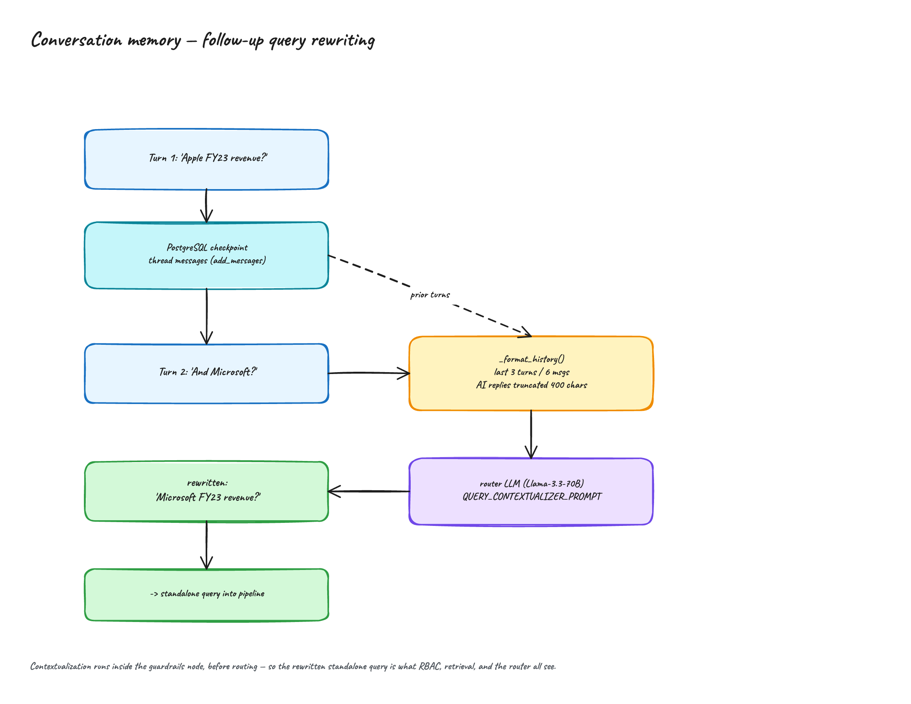
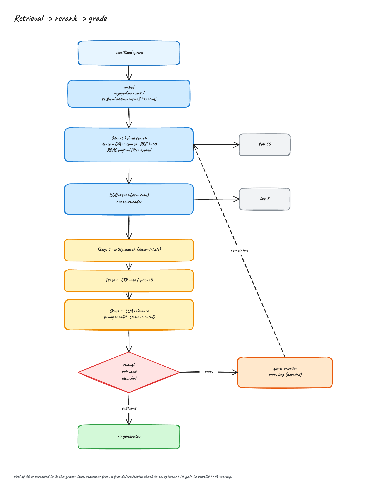
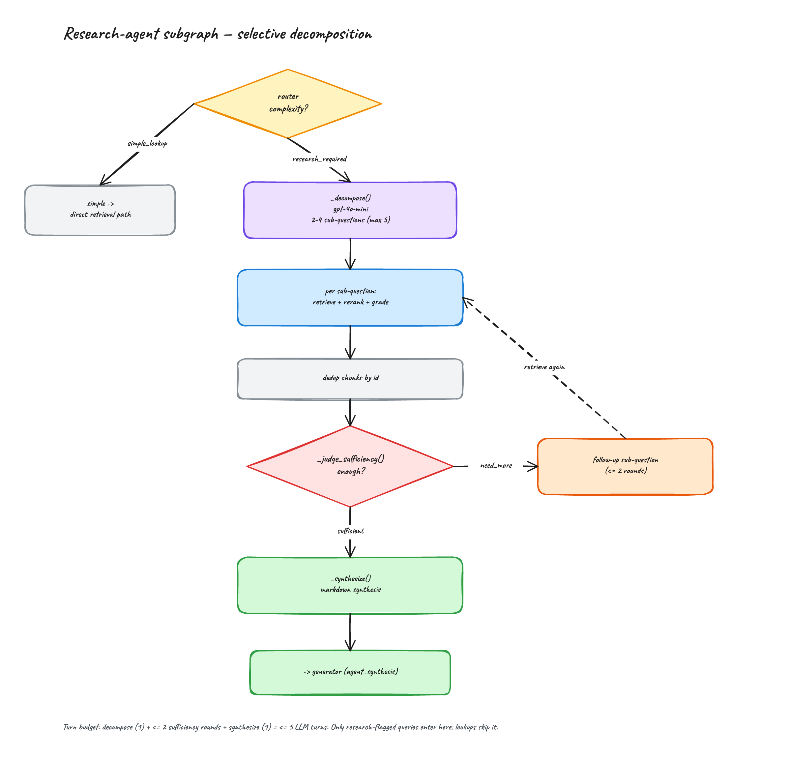
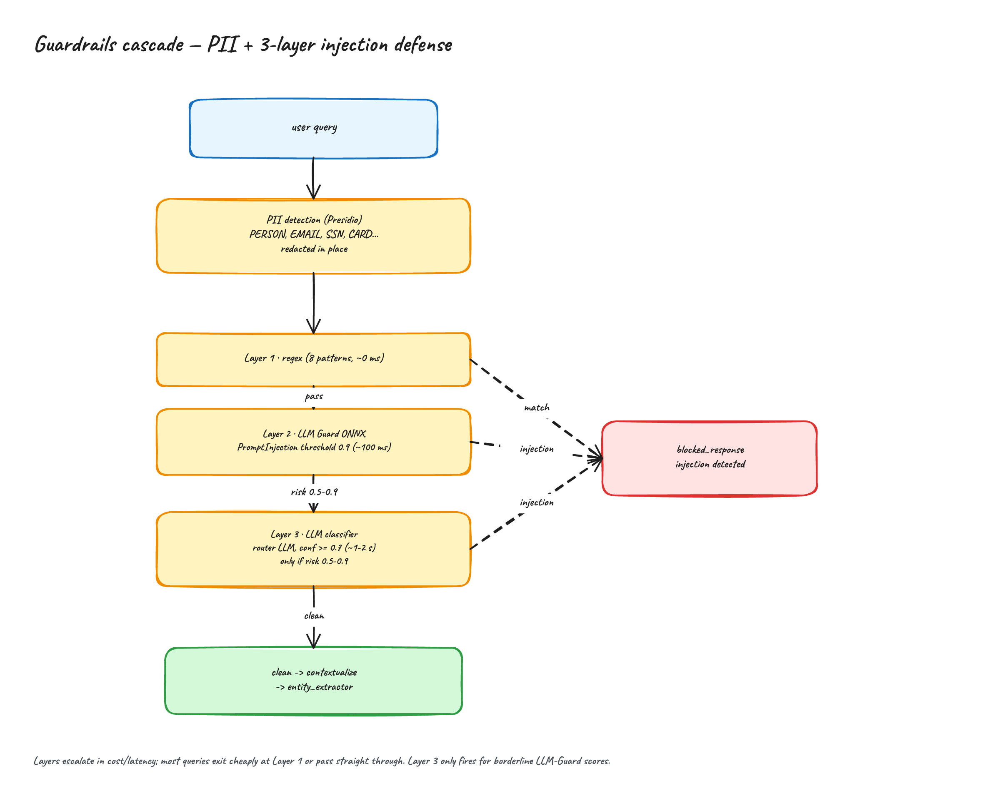
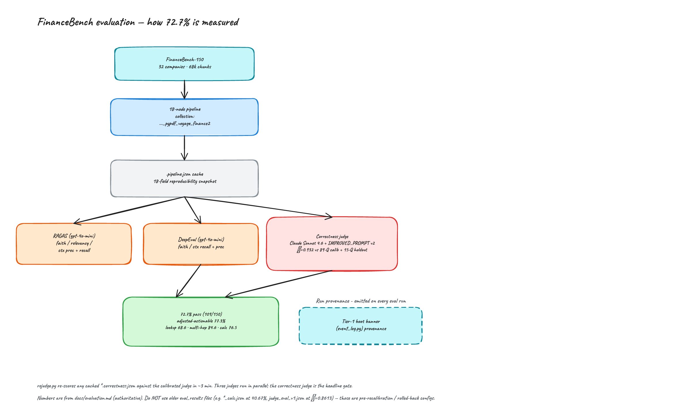

# Architecture

## Overview

The FinanceBench RAG Agent is a `StateGraph` built with LangGraph 0.6. Every query flows through 18 nodes connected by 6 conditional edge routers. State is a `TypedDict` ([src/models/state.py](../src/models/state.py)) that accumulates across the pipeline; per-turn fields are reset on each new invocation, while `messages` is appended via the `add_messages` reducer to preserve conversation history.

## Graph Topology

`START → rbac_gate → guardrails → entity_extractor → router`. The router sends simple lookups down the direct path (`retrieval → reranker → retrieval_evaluator → grader`) and research-required queries into the `research_agent` subgraph; both converge on `generator → hallucination_checker → hitl_gate → response_formatter → END`. Conditional retries loop retrieval (via `query_rewriter`) and generation; the four terminal nodes (`blocked_response`, `out_of_scope_response`, `clarification_response`, `no_info_response`) short-circuit to `END`.

## Component diagrams

Deep-dives into the subsystems described below.

**Role-based access control** — roles resolve to a Qdrant payload filter; enforcement happens at the storage layer, so agentic queries cannot bypass it.

**Human-in-the-loop approval** — high-stakes answers pause via `interrupt()`, persist to Postgres, and require a different party to approve (self-approval blocked).

**Conversation memory** — follow-up questions are rewritten into standalone queries from thread history before routing.

**Retrieval → rerank → grade** — hybrid dense+BM25 (RRF) to a top-50 pool, cross-encoder rerank to top-8, then a 3-stage grader.

**Research-agent subgraph** — selective decomposition for research-required queries, bounded to ≤5 LLM turns.

**Guardrails cascade** — PII redaction then a 3-layer injection defense escalating by cost.

**Evaluation methodology** — how the 72.7% FinanceBench pass rate is measured under a calibrated judge.

## Node Responsibilities

### Entry and Safety

| Node | File | Purpose |
|------|------|---------|
| `rbac_gate` | [src/graph/nodes/rbac_gate.py](../src/graph/nodes/rbac_gate.py) | Maps JWT role → allowed doc types/confidentiality |
| `guardrails` | [src/graph/nodes/guardrails.py](../src/graph/nodes/guardrails.py) | PII redaction (Presidio), 3-layer injection defense, query contextualization |
| `entity_extractor` | [src/graph/nodes/entity_extractor.py](../src/graph/nodes/entity_extractor.py) | Two-tier company/fiscal-year extraction (dictionary pass + LLM fallback) used as a Qdrant payload filter |

The guardrails node runs three injection checks in order of cost: (1) regex heuristics, (2) LLM Guard's PromptInjection scanner, (3) an LLM classifier — only invoked when LLM Guard returns a borderline score (0.5 ≤ x < 0.9). After safety checks pass, it runs a contextualization step that rewrites coreferential follow-ups (e.g., "what about Microsoft?") into standalone questions using prior message history.

### Routing

| Node | File | Purpose |
|------|------|---------|
| `router` | [src/graph/nodes/router.py](../src/graph/nodes/router.py) | Classifies intent (retrieval / clarification / out_of_scope) and complexity (simple lookup vs research-required) |

Structured output via Pydantic. Uses Llama 3.3 70B on Groq (free tier) with automatic fallback to GPT-4o-mini. The complexity classification is what selects the direct retrieval path versus the `research_agent` subgraph.

### Retrieval and Correction

| Node | File | Purpose |
|------|------|---------|
| `retrieval` | [src/graph/nodes/retrieval.py](../src/graph/nodes/retrieval.py) | Qdrant hybrid search — dense + BM25 sparse fused via RRF (k=60), RBAC payload filter applied at query time, top-50 pool |
| `reranker` | [src/graph/nodes/reranker.py](../src/graph/nodes/reranker.py) | BAAI/bge-reranker-v2-m3 cross-encoder; reranks the pool down to top-8 |
| `retrieval_evaluator` | [src/graph/nodes/retrieval_evaluator.py](../src/graph/nodes/retrieval_evaluator.py) | Optional CRAG-style sufficiency check before grading |
| `grader` | [src/graph/nodes/grader.py](../src/graph/nodes/grader.py) | 3-stage relevance: entity_match (deterministic) → optional LTR gate → 8-way parallel LLM grading |
| `query_rewriter` | [src/graph/nodes/query_rewriter.py](../src/graph/nodes/query_rewriter.py) | Rewrites the query if grading failed |

Retrieval pulls a top-50 pool, the cross-encoder reranks to top-8, and the grader filters those for relevance in three escalating stages (free deterministic entity match → optional learning-to-rank gate → parallel LLM grading). If fewer than `GRADING_MIN_RELEVANT_CHUNKS` are relevant, the graph loops back via `query_rewriter` up to `MAX_RETRIEVAL_RETRIES` (default 2) times. After retries are exhausted, the graph terminates with `no_info_response`. The reranker uses the stock `bge-reranker-v2-m3`; a LoRA adapter hook exists (`RERANKER_ADAPTER_PATH`) but is inactive in the canonical configuration.

### Research-agent subgraph

| Node | File | Purpose |
|------|------|---------|
| `research_agent` | [src/graph/nodes/research_agent.py](../src/graph/nodes/research_agent.py) | Selective multi-turn subgraph for research-required queries |

When the router flags a query as research-required, it enters this subgraph instead of the direct retrieval path. It decomposes the question into 2–4 sub-questions (`gpt-4o-mini`, capped at 5), runs each through the same `retrieval → reranker → grader` stages, deduplicates the resulting chunks, and judges sufficiency (`gpt-4o-mini`). If insufficient it issues a follow-up sub-question, bounded to 2 rounds, then synthesizes a markdown answer (`claude-sonnet-4-6`) that flows into the generator. The whole subgraph is bounded to ≤5 LLM turns (`MAX_LLM_TURNS`). Simple lookups never enter it — this is the selective-agentic differentiator.

### Generation and Verification

| Node | File | Purpose |
|------|------|---------|
| `generator` | [src/graph/nodes/generator.py](../src/graph/nodes/generator.py) | Claude Sonnet 4.6 generates the answer from relevant chunks (prompt-cached system prompt); appends AIMessage to state |
| `hallucination_checker` | [src/graph/nodes/hallucination.py](../src/graph/nodes/hallucination.py) | Claude Sonnet 4.6 verifies the answer is grounded in retrieved sources (separate high-stakes path, also Sonnet 4.6) |

If the hallucination check returns `grounded=False` with confidence below `HALLUCINATION_THRESHOLD` (0.7), the graph loops back to `generator` up to `MAX_GENERATION_RETRIES` (default 2) times. After retries, the answer is returned with a disclaimer.

### Approval and Formatting

| Node | File | Purpose |
|------|------|---------|
| `hitl_gate` | [src/graph/nodes/hitl_gate.py](../src/graph/nodes/hitl_gate.py) | Interrupts graph if dollar amount exceeds role threshold |
| `response_formatter` | [src/graph/nodes/response_formatter.py](../src/graph/nodes/response_formatter.py) | Builds final response with deduplicated source list |

The HITL gate extracts dollar amounts from the generated answer via regex (handles `$100k`, `$2.5M`, `$383.3 billion`, etc.), compares against `requires_hitl_above` from [rbac_config.py](../src/config/rbac_config.py), and calls `interrupt()` when over threshold. Execution resumes via `POST /hitl/approve` or `/hitl/reject`, which invoke the graph with `Command(resume="approved"|"rejected")`.

### Terminal Nodes

All four terminal nodes live in [src/graph/nodes/terminal_nodes.py](../src/graph/nodes/terminal_nodes.py):

- `blocked_response` — guardrails or HITL rejection
- `out_of_scope_response` — router classified query as off-topic
- `clarification_response` — router needs more info
- `no_info_response` — retrieval+grading failed after retries

## Conditional Edge Logic

All routing logic is in [src/graph/edges.py](../src/graph/edges.py):

| Router | From | Targets |
|--------|------|---------|
| `route_after_guardrails` | `guardrails` | `clean` → `entity_extractor`, `blocked` → `blocked_response` |
| `route_after_router` | `router` | `retrieval`, `research_required` → `research_agent`, `clarification`, `out_of_scope` |
| `route_after_retrieval_evaluator` | `retrieval_evaluator` | `accept` → `grader`, `retry` → `query_rewriter` |
| `route_after_grading` | `grader` | `sufficient` → `generator`, `retry` → `query_rewriter`, `no_info` → `no_info_response` |
| `route_after_hallucination` | `hallucination_checker` | `grounded`/`disclaimer` → `hitl_gate`, `retry` → `generator` |
| `route_after_hitl` | `hitl_gate` | `no_approval_needed`/`approved` → `response_formatter`, `rejected` → `blocked_response` |

## State Management

`RAGState` ([src/models/state.py](../src/models/state.py)) has ~21 fields grouped by concern:

- **Input**: `messages` (with `add_messages` reducer)
- **Auth**: `user_id`, `user_role`, `allowed_doc_types`
- **Guardrails**: `guardrail_status`, `detected_pii_entities`, `sanitized_query`
- **Routing**: `query_intent`
- **Retrieval**: `retrieved_chunks`, `retrieval_query`
- **Grading**: `relevant_chunks`, `grading_results`
- **Generation**: `generated_answer`
- **Hallucination**: `hallucination_status`, `hallucination_score`
- **HITL**: `requires_human_approval`, `human_decision`
- **Control flow**: `retrieval_retry_count`, `generation_retry_count`
- **Output**: `final_response`, `response_metadata`

The `messages` field uses LangGraph's `add_messages` reducer, which *appends* rather than replaces. This means when the same `thread_id` is re-invoked, prior messages are retained automatically (via PostgresSaver checkpointing), enabling multi-turn conversations.

## LLM Strategy

Managed by [LLMFactory](../src/services/llm_factory.py). Provider selection per node:

| Node | Primary | Fallback | Why |
|------|---------|----------|-----|
| `router` | Groq Llama 3.3 70B | OpenAI GPT-4o-mini | Classification task, free tier |
| `grader` | Groq Llama 3.3 70B | OpenAI GPT-4o-mini | Binary classification, high volume |
| `query_rewriter` | Groq Llama 3.3 70B | OpenAI GPT-4o-mini | Simple rewriting |
| `guardrails` (contextualizer, injection layer 3) | Groq Llama 3.3 70B | OpenAI GPT-4o-mini | Classification/rewriting |
| `generator` | Claude Sonnet 4.6 | — | Financial accuracy matters; system prompt is prompt-cached |
| `hallucination_checker` | Claude Sonnet 4.6 | — | Nuanced grounding assessment; high-stakes path also Sonnet 4.6 (configurable to Opus) |
| `research_agent` (decompose, sufficiency) | OpenAI GPT-4o-mini | — | High-volume planning turns, cost-sensitive |
| `research_agent` (synthesize) | Claude Sonnet 4.6 | — | Final synthesis quality matters |

Classification-tier providers (router/grader/query_rewriter/guardrails) fall back automatically on exceptions (rate limits, outages); the Anthropic generation tier does not fall back.

## Ingestion Pipeline

Separate from the query graph. Lives in [src/ingestion/](../src/ingestion/):

1. [docling_loader.py](../src/ingestion/docling_loader.py) — PDF → per-page text (pypdf) + markdown (Docling)
2. [metadata_extractor.py](../src/ingestion/metadata_extractor.py) — Detects `doc_type`, `company`, `confidentiality`
3. [chunker.py](../src/ingestion/chunker.py) — Recursive splitter (~800 chars, 150 overlap), chunks each page independently so every chunk carries a `page_number`
4. [qdrant_uploader.py](../src/ingestion/qdrant_uploader.py) — Embeds (voyage-finance-2 canonical, OpenAI text-embedding-3-small as the 1536-dim fallback) and upserts to Qdrant in batches

Run via `python scripts/seed_qdrant.py --sample` or `python scripts/internal/data_prep/ingest_documents.py --input data/raw/`.

## Persistence

PostgreSQL stores LangGraph checkpoints for HITL resumption and conversation history. Initialized in [src/api/main.py](../src/api/main.py) lifespan via `AsyncPostgresSaver`. On API startup, the checkpointer tables are created with `CREATE INDEX CONCURRENTLY`, which requires an autocommit connection (handled separately from the runtime pool).

If PostgreSQL is unavailable, the app logs an error and continues with HITL disabled — the graph runs without a checkpointer and interrupts are auto-approved.

## Observability

LangSmith tracing is always on when `LANGCHAIN_API_KEY` is set. Every graph invocation is tagged with:
- `run_name`: `"rag_query"` or `"rag_query_stream"`
- `tags`: `["api", f"role:{user.role}"]`
- `metadata`: `{"user_id", "role", "thread_id", "hitl_enabled"}`

Project names are environment-specific via `settings.langchain_project_name` (e.g., `rag-agent-dev`, `rag-agent-prod`).

For LLM cost and usage observability, every model call is routed through a LiteLLM proxy that forwards traces to a self-hosted Langfuse v3 instance ([settings.py](../src/config/settings.py) `LANGFUSE_*`). The admin cost endpoints ([src/api/routes/admin.py](../src/api/routes/admin.py)) query Langfuse's API to aggregate spend by user, model, and trace name, so cost attribution lives in Langfuse rather than in the agent itself.

## Evaluation

Current FinanceBench results, methodology, the calibrated judge (Cohen's κ = 0.932), and reproduction commands live in [docs/evaluation.md](evaluation.md). CI regression thresholds are defined in [tests/evaluation/eval_config.py](../tests/evaluation/eval_config.py).
